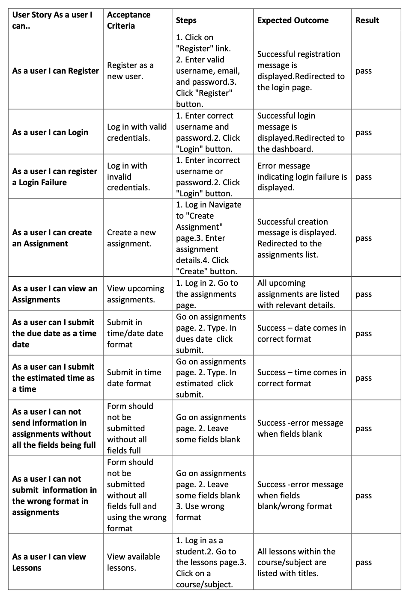
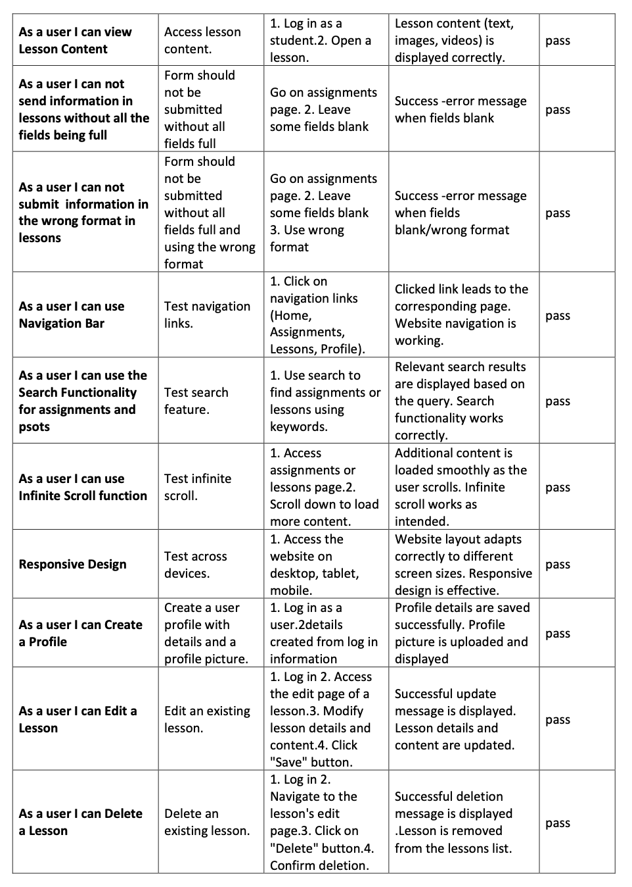

# Virtual class

Virtual class is a site that allows primary school classes to run a virtual classroom by posting lessons and assignments. I allows teachers to post assignments and lessons to a class. I also allows users to post their own posts under the 'post' section to others in their class commmunity. In the lessons section teachers are able to post courses, and difficulty levels. In the feed they are able to edit and delete their posts. In the assignments section teachers are able to post due dates descriptions and estimated times. In the assignment feed pupils are able to search the assignments for subjects and titles.

https://virtualclassapi1-094fa25a6c74.herokuapp.com/

## Table of Contents

- [User Experience (UX)](#user-experience-ux)
- [Features](#features)
- [Design](#design)
- [Planning](#planning)
- [Technologies Used](#technologies-used)
- [Testing](#testing)
- [Deployment](#deployment)
- [Credits](#credits)

## User Experience (UX)

### User Stories

1. Navigation & Authentication:
   o As a user, I want to see a consistent navigation bar on all pages, enabling easy navigation.
   o As a user, I want to navigate seamlessly through pages with minimal page refresh.
   o As a user, I want to create a new account to access all features.
   o As a user, I want to sign in to access user-specific functionality.
   o As a user, I want to view my authentication status and log in if necessary.
   o As a user, I want my logged-in status maintained until I log out.
   o As a logged-out user, I want to see sign-in and sign-up options in the navigation bar.
   o As a user, I want to see avatars to easily identify users.
2. Posts Page:
   o As a user, I want to view most recent posts in a chronological order.
   o As a user, I want to search for posts using keywords.
   o As a logged-in user, I want to view posts
   o As a user, I want infinite scroll for a seamless browsing experience.
3. Post Page:
   o As a user, I want to view post details and associated comments.
   o As a post owner, I want to edit my post's title and description.
   o As a logged-in user, I want to comment on a post.
   o As a user, I want to see the posting date of comments.
   o As a user, I want to view and interact with comments.
   o As a comment owner, I want to delete or edit my comments.
4. Profile Page:
   o As a user, I want to view other users' profiles.
   o As a user, I want to view all posts by a specific user.
   o As a logged-in user, I want to edit my profile and update username/password.
5. Assignment Model:
   o As a teacher, I want to create assignments with titles, descriptions, and due dates.
   o As a teacher, I want to attach images to assignments.
   o As a student, I want to see assignment details and attached images.
   o As a user, I want infinite scroll for a seamless browsing experience.
   o As a user, I want to search for posts using keywords.
   o
6. Lesson Model:
   o As a teacher, I want to create lessons with content (text, images, ).
   o As a student, I want to access lessons by title.
   o As a student, I want to view lesson content (text, images, v).
   o As a teacher, I want to update and delete lesson content.
   o As a user, I want infinite scroll for a seamless browsing experience.
   o

## Features

### Existing Features

F01 Navigation Bar
• The navigation bar ensures consistent appearance and placement across all pages, facilitating easy and intuitive navigation. It comprises a logo and links to the Home page, Assignments, and Lessons. For non-signed-in users, there are additional links to the Register and Sign In pages. Once signed in, users can access the Home page along with links to new assignments and lessons. The navigation bar also displays the active username and a user icon. It adapts responsively to different screen sizes, transforming into a "burger" menu style on smaller screens.

F02 Landing Page Image and Text
• Located at the top of the landing page (home page), there is a visually appealing section featuring the feed of the posts.

F03 View Assignments
• On the assignment page a list of upcoming assignments is displayed. Each assignment summary includes its title, description, due date, and attachments. At a glance, the user can quickly see the details of each assignment. Clicking on an assignment title expands the details, allowing users to view the assignment's full description

F04 View Lessons

• When a user clicks on a lesson title on the home page, they are directed to the Lesson Detail page for the selected lesson. Here, the user is presented with the full lesson content, which can include text, images,. Lessons are organized by courses/subjects, and only registered users can access and view lessons. Users can searchthourhg the lessons using the search bar

F05 Comment on Posts
• Registered users have the ability to comment on posts. The comment section is located below each post description. Users can enter their comments in a text box and click "Submit." Comments must be approved by an admin user before becoming visible to others. Admin users can log in to the admin pages, review and approve comments for publication.

F06 User Authentication
• The application offers user authentication features, including user registration, sign-in, and sign-out. New users can register by providing a username, optional email address, and password. After registration, users can sign in to access additional features. Signed-in users can comment on assignments and lessons. Users can sign out by clicking the "Sign out" link in the navigation bar.

F07 Add and Publish Assignments
• Users, can add and publish assignments.. New assignments can be added with details like title, description, due date, and attachments. Assignments must have unique titles, and the system generates a slug from the title.

F08 Add and Publish Lessons
• Similar to assignments, users can add and publish lessons using the admin pages. They can enter lesson details including title, content, associated course/subject, and multimedia elements like images and videos. Lessons are organized by courses/subjects and provide valuable educational content for users.
• .

## Renewable components

Reusable Component - User Profile Card

In my application, I've strategically utilized reusable components, and an example is the "User Profile Card." This component is pivotal in presenting user profiles throughout the app, ensuring a consistent and visually appealing display.
The "User Profile Card" consolidates the rendering logic for user profiles, making it a easy to showcase user information in a standardized format. By employing this component, I've achieved code reusability and maintainability, as any updates or enhancements related to user profiles can be efficiently managed within the "User Profile Card." This can be seen on posts and l;essons and in the profile area.

This reusable component eliminates redundancy within my codebase. Instead of duplicating the same user profile rendering logic across various parts of the app.

Furthermore, the "User Profile Card" promotes design consistency. Users can expect a uniform and polished profile display, regardless of where they encounter it.

## database schema

## design choices

the website has been kept simple and easy to use for children. the add post/lesson/assignment have a very similar design to help familiarity. the background was keps simple and bright. A suitible logo was designed to illustrate the purpose of the site. "DM Sans", sans-serif; was chosen as a simple font that children could read easily.

## wireframe

## Testing

## Planning

A GitHub Project with linked Issues was used as the Agile tool for this project. The acceptance criteria were tested as each story moved to 'Done' and were also included in the final pre-submission manual testing documented in the Testing section of this README. I have attached a image of the agile and moved the stories around for ease of reading rather than all done

Agile tool can be found here: [Aglie](https://github.com/users/robinoldman/projects/3/views/1)

### Languages Used

- HTML5
- CSS3
- Python
- Javascript
- React

### Frameworks, Libraries & Programs Used

1. Django: Utilized as the framework to facilitate rapid and secure development of the application.
2. Google Fonts: Incorporated to implement the Lato font in the project.
3. Font Awesome: Employed to enhance aesthetics and user experience by adding icons.
4. Bootstrap: Utilized to create responsive web pages.
5. Git and GitHub: Employed for version control, using the Gitpod terminal to commit changes to Git and push them to GitHub. Additionally, GitHub was used for agile development by utilizing User Stories (GitHub Issues) and tracking progress on a Kanban board.
6. Gunicorn: Used as the web server to run Django on Heroku.
7. psycopg2: A database adapter used to support the connection to the PostgreSQL database.
8. Cloudinary: Utilized as a storage solution for the application's images.
9. Django allauth: Employed for account registration and authentication functionality.
10. React

### Browser Compatibility

To ensure the application's compatibility across different browsers, the following approach was taken:

- Chrome DevTools: Used to test the application's responsiveness on various screen sizes during development.

### Known bugs

Currently, there are no known bugs.

## Deployment

Deployment Instructions:

To deploy this project, follow the detailed steps outlined below. Code Institute also provides a summary of similar processes, which can be found here: [Link to Code Institute deployment summary]

1. Cloning the Repository:

   - Visit the project repository on GitHub: [Link to GitHub Repository]
   - Click the "Code" button on the right side of the screen, select "HTTPs," and copy the provided link.
   - Open a GitBash terminal and navigate to the desired directory for the clone.
   - In the terminal, enter "git clone" followed by the copied URL, then press Enter to initiate the cloning process.
   - Install the required packages by running the command: "pip install -r requirements.txt."
   - When developing and running the application locally, set DEBUG=True in the settings.py file.
   - Push any changes made to the local clone back to the repository using the commands: "git add filenames" (or "." to add all changed files), "git commit -m 'text message describing changes'," and "git push."
   - Note: Changes pushed to the master branch will take effect on the live project once the application is redeployed from Heroku.

2. Creating the Application and Postgres DB on Heroku:

   - Log in to Heroku at https://heroku.com (create an account if necessary).
   - From the Heroku dashboard, click the "Create new app" button. If you have a new account, an icon will be visible on the screen; otherwise, access this function under the "New" dropdown menu.
   - On the "Create New App" page, provide a unique name for the application, select a region, and click "Create app."
   - In the Application Configuration page for the new app, navigate to the "Resources" tab.
   - Search for "Postgres" in the Add-ons search bar and select "Heroku Postgres" from the list. Follow the prompts to submit the order form.
   - Next, go to the "Settings" tab on the Application Configuration page and click the "Reveal Config Vars" button. Ensure that the DATABASE_URL has been automatically set up.
   - Add two new Config Vars: DISABLE_COLLECTSTATIC (set value as 1) and SECRET_KEY (assign a random string of letters, digits, and symbols).
   - Update the settings.py file to use the DATABASE_URL and SECRET_KEY environment variable values as follows:
     - DATABASES = {'default': dj_database_url.parse(os.environ.get('DATABASE_URL'))}
     - SECRET_KEY = os.environ.get('SECRET_KEY')
   - In Gitpod, in the project terminal window, run the command "python3 manage.py migrate" to initialize the data model in the Postgres database.
   - Ensure that the project's requirements.txt file is up to date with all necessary supporting files by entering the command "pip3 freeze --local > requirements.txt."
   - Commit and push any local changes to GitHub.
   - To run the application on localhost, add SECRET_KEY and DATABASE_URL with their respective values to env.py.

3. Configuring Cloudinary for Hosting Images:
   - Log in to Cloudinary (create an account if needed) and access the dashboard.
   - Copy the "API Environment variable" value from the dashboard.
   - Log in to Heroku, go to the Application Configuration page, and click "Settings." Then click "Reveal Config Vars."
   - Add a new Config Var named CLOUDINARY_URL and assign it the value copied from the Cloudinary dashboard, excluding the "CLOUDINARY_URL=" prefix.
   - To run the application on localhost, add the CLOUDINARY_URL environment variable and its value to env.py.

Connecting the Heroku App to the GitHub Repository:

To establish the connection between your Heroku app and the GitHub repository, follow these steps:

1. Go to the Application Configuration page of your Heroku app and navigate to the "Deploy" tab.
2. Choose "GitHub" as the Deployment Method. If prompted, confirm your intention to connect to GitHub.
3. Enter the name of your GitHub repository (the one used for this project) and click "Connect" to establish the link between your Heroku app and the GitHub repository code.
4. Scroll down the page and select either "Automatically Deploy" (triggering deployment whenever changes are pushed to GitHub) or "Manually Deploy" (allowing manual control over deployment). For this project, "Manual Deploy" was selected.
5. To run the application, you can access it directly from the Application Configuration page by clicking the "Open App" button.
6. The live link for this project can be found at [insert live link here].

Final Deployment Steps:

After completing and testing the code changes on localhost, follow these steps to prepare the application for deployment

Step 1: Installing WhiteNoise

In the terminal:
Ensure you are in the root directory of your project.
Install WhiteNoise by running the following command:

    pip3 install whitenoise==6.4.0

Step 2: Adding WhiteNoise to Settings

In settings.py:
In the INSTALLED_APPS list, place 'cloudinary_storage' below 'django.contrib.staticfiles' to prioritize WhiteNoise for static files.

INSTALLED_APPS = [

# ...

'django.contrib.staticfiles',
'cloudinary_storage',

# ...

]

In the MIDDLEWARE list, add WhiteNoiseMiddleware just below SecurityMiddleware and above SessionMiddleware.

In the TEMPLATES list, add the following code to the DIRS list to specify where to find React's index.html file for deployment.

TEMPLATES = [
{ # ...
'DIRS': [os.path.join(BASE_DIR, 'staticfiles', 'build')], # ...
},
]

Add the STATIC_ROOT and WHITENOISE_ROOT variables to specify the locations of admin and React static files during deployment.

    STATIC_ROOT = BASE_DIR / 'staticfiles'
    WHITENOISE_ROOT = BASE_DIR / 'staticfiles' / 'build'

Step 3: Updating URLs

In the urls.py file of your Django Rest Framework application:
Remove the import of 'root_route' from the .views imports.
Import the TemplateView from the generic Django views.
Replace the root_route code in the url_patterns list with a TemplateView pointing to the index.html file.
At the bottom of the file, add the 404 handler to allow React to handle 404 errors.

Step 4: Configuring axiosDefaults.js

In axiosDefaults.js:
Comment in the axios.defaults.baseURL line and set it to "/api".

Step 5: Collecting Static Files

In the terminal:

Ensure all running servers are terminated (Ctrl+C in running terminals).
In your env.py file, comment out both the DEBUG and DEV environment variables.

Run the Django server.

Step 6: Preparing for Deployment

Make sure to commit your changes. You are now ready to deploy the project to Heroku. If you haven't deployed to Heroku before, refer to the Deployment section of the Django REST Framework module for additional steps.

Step 7: Heroku Configuration

On Heroku:

Log into your Heroku account and access the dashboard for your DRF application.
Go to Settings and open the Config Vars.
Ensure your application has an ALLOWED_HOST key, set to the URL of your combined project without "https://" at the beginning and without a trailing slash at the end.
Ensure your application has a CLIENT_ORIGIN key and set it to the URL of your combined project with "https://" at the beginning, but without a trailing slash at the end.
If you had a value for CLIENT_ORIGIN before, update it to match the URL for your combined application.
Double-check that all your settings are in place, including those from the Deployment section of the Django REST Framework module. Save, commit, and push any code changes.
Deploy your application from the Deploy tab in your Heroku dashboard.

## next steps

If I had more time I would do the following

- allow the teacher to assign specific lessons and assignments to specific users rather than just creating names in the admin and assigning names from the dropdown
- allow children to post their reply either as a comment or to send to the teacher.

## credits

- The site was heavily inspired from the code institute moments walkthrough model.
- Thank you to Lauren my mentor and Patrick my brother who expertly guided me through the project and gave me invaluable tips.
